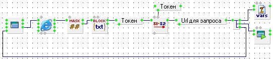
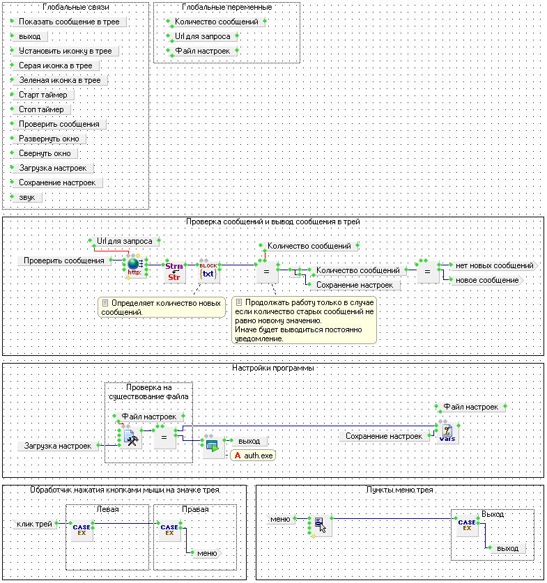
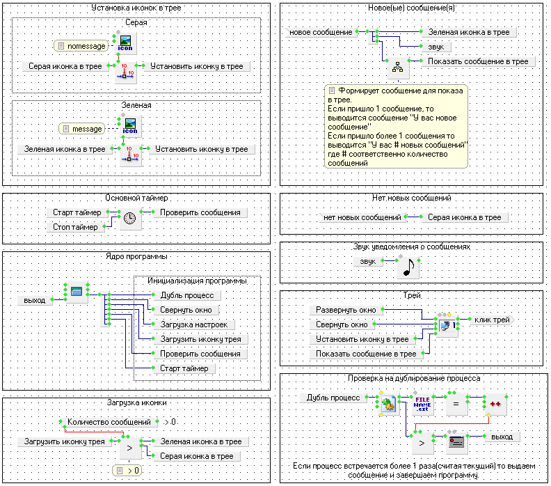

Утилита для уведомления о новых сообщениях в ВК.

Состоит из 2х компонентов:

* auth.exe      - файл для создания конфигурации. Осуществляет авторизацию на странице ВК и записывает настройки токена в *.ini файл.
* vknotifer.exe - основной файл. Создает иконку в трее и отвечает за уведомления.

## Скриншоты кода:

### auth.exe

### vknotifer.exe

